# MySQL

## MySQL的优化

### 1、概念

在应用的的开发过程中，由于初期数据量小，开发人员写 SQL 语句时更重视功能上的实现，但是当应用系统正式上线后，
随着生产数据量的急剧增长，很多 SQL 语句开始逐渐显露出性能问题，对生产的影响也越来越大，此时这些有问题的 SQL 
语句就成为整个系统性能的瓶颈，因此我们必须要对它们进行优化。

MySQL的优化方式有很多，大致我们可以从以下几点来优化MySQL:

- 从设计上优化

- 从查询上优化

- 从索引上优化

- 从存储上优化

### 2、查看SQL执行频率

MySQL 客户端连接成功后，通过 show [session|global] status 命令可以查看服务器状态信息。通过查看状态信息可以查看对当前数据库的主要操作类型。


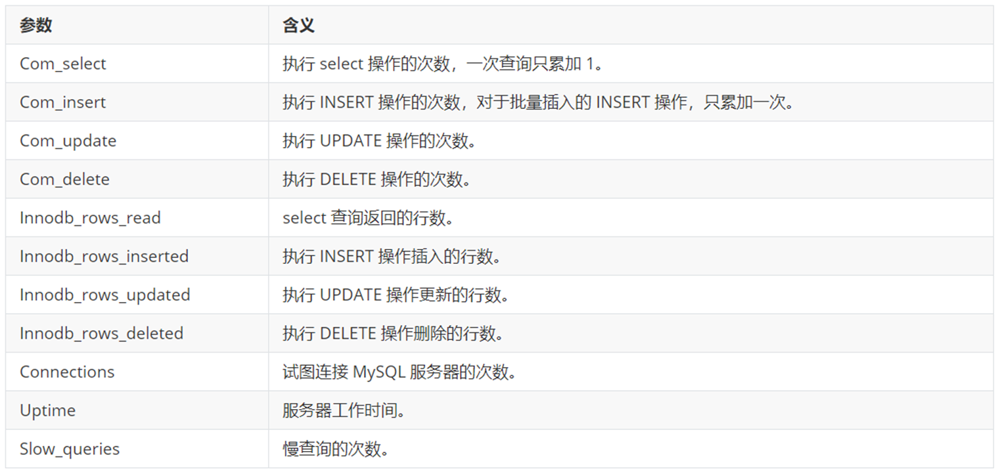

```sql
-- 查看当前会话SQL执行类型的统计信息
SHOW SESSION STATUS LIKE 'Com_______';

-- 查看全局（自从上次MySQL服务器启动至今）执行类型的统计信息
SHOW SESSION STATUS LIKE 'Com_______';

-- 查看针对InnoDB引擎的统计信息
SHOW STATUS LIKE 'Innodb_rows_%';
```

### 3、定位低效率执行SQL

可以通过以下两种方式定位执行效率较低的 SQL 语句。 

- 慢查询日志 : 通过慢查询日志定位那些执行效率较低的 SQL 语句。
- show processlist：该命令查看当前MySQL在进行的线程，包括线程的状态、是否锁表等，可以实时地查看 SQL 的执行情况，同时对一些锁表操作进行优化。

#### 1.慢查询日志

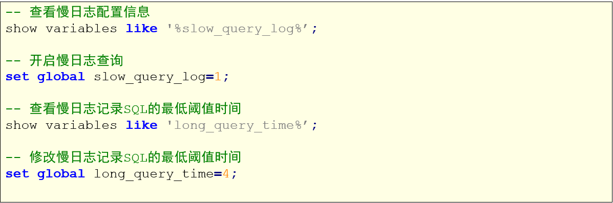

```sql
-- 慢日志查询

-- 查看慢日志配置信息
SHOW VARIABLES LIKE '%slow_query_log%';

-- 开启慢日志查询
SET GLOBAL slow_query_log = 1;

-- 查看慢日志记录SQL的最低阈值时间，默认如果SQL的执行时间>=10秒，则算慢查询，则会将该操作记录到日志中去
SHOW VARIABLES LIKE '%long_query_time%';
SELECT SLEEP(12);
SELECT SLEEP(10);

-- 修改慢日志记录SQL的最低阈值时间
SET GLOBAL long_query_time = 5;
```

#### 2.SHOW PROCESSLIST

```sql
-- SHOW PROCESSLIST
SHOW PROCESSLIST;
```

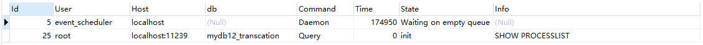

1. id列，用户登录mysql时，系统分配的"connection_id"，可以使用函数connection_id()查看
2.  user列，显示当前用户。如果不是root，这个命令就只显示用户权限范围的sql语句
3.  host列，显示这个语句是从哪个ip的哪个端口上发的，可以用来跟踪出现问题语句的用户
4.  db列，显示这个进程目前连接的是哪个数据库
5.  command列，显示当前连接的执行的命令，一般取值为休眠（sleep），查询（query），连接（connect）等
6.  time列，显示这个状态持续的时间，单位是秒
7.  state列，显示使用当前连接的sql语句的状态，很重要的列。state描述的是语句执行中的某一个状态。一个sql语句，以查询为例，可能需要经过copying to tmp table、sorting result、sending data等状态才可以完成
8.  info列，显示这个sql语句，是判断问题语句的一个重要依据

### 4、EXPLAIN分析执行计划

通过以上步骤查询到效率低的 SQL 语句后，可以通过 EXPLAIN命令获取 MySQL如何执行 SELECT 语句的信息，包括在 SELECT 语句执行过程中表如何连接和连接的顺序。

```sql
EXPLAIN SELECT * FROM user WHERE uid = 1;
```

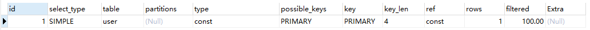

```sql
EXPLAIN SELECT * FROM user WHERE uname = '张飞';
```

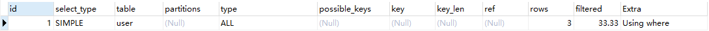

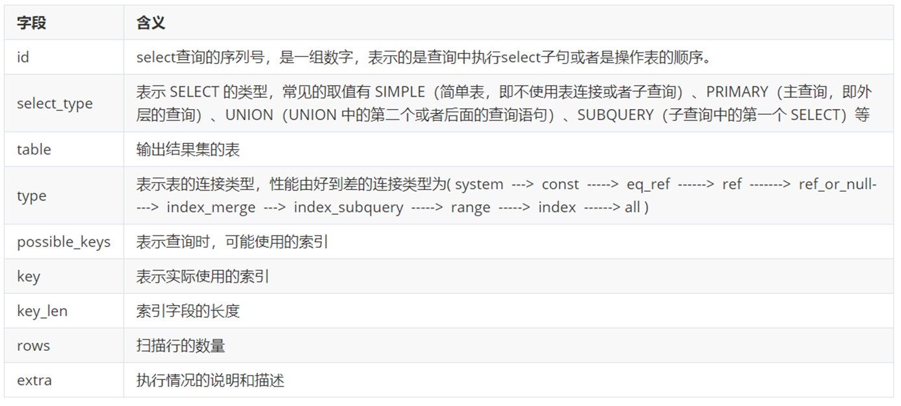

#### 1.id

id 字段是 select查询的序列号，是一组数字，表示的是查询中执行select子句或者是操作表的顺序。id 情况有三种:

1. id 相同表示加载表的顺序是从上到下。

   ```sql
   EXPLAIN SELECT * FROM user u, user_role ur, role r WHERE u.uid = ur.uid AND ur.rid = r.rid;
   ```

   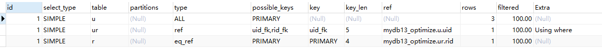

2. id 不同id值越大，优先级越高，越先被执行。 

   ```sql
   EXPLAIN SELECT * FROM role WHERE rid = (SELECT rid FROM user_role WHERE uid = (SELECT uid FROM user WHERE uname = '张飞'));
   ```

   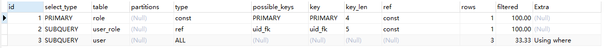

3. id 有相同，也有不同，同时存在。id相同的可以认为是一组，从上往下顺序执行；在所有的组中，id的值越大，优先级越高，越先执行。

   ```sql
   EXPLAIN SELECT * FROM role r, (SELECT * FROM user_role ur WHERE ur.uid = (SELECT uid FROM user WHERE uname = '张飞')) t WHERE r.rid = t.rid;
   ```

   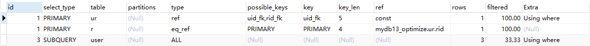

#### 2.select_type

表示 SELECT 的类型，常见的取值，如下表所示：

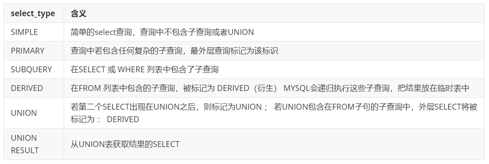

```sql

-- EXPLAIN之select_type

-- SIMPLE:没有子查询和union
EXPLAIN SELECT * FROM user;
EXPLAIN SELECT * FROM user u, user_role ur WHERE u.uid = ur.uid;

-- PRIMARY:主查询，也就是子查询中的最外层查询
EXPLAIN SELECT * FROM role WHERE rid = (SELECT rid FROM user_role WHERE uid = (SELECT uid FROM user WHERE uname = '张飞'));

-- SUBQUERY:在select和where中包含子查询
EXPLAIN SELECT * FROM role WHERE rid = (SELECT rid FROM user_role WHERE uid = (SELECT uid FROM user WHERE uname = '张飞'));

-- DERIVED:在from中包含子查询，被标记为衍生表
EXPLAIN SELECT * FROM (SELECT * FROM user limit 2) t;

-- UNION
-- UNION RESULT
EXPLAIN SELECT * FROM user WHERE uid = 1 UNION SELECT * FROM user WHERE uid = 3;
```

#### 3.type

type 显示的是访问类型，是较为重要的一个指标，可取值为： 

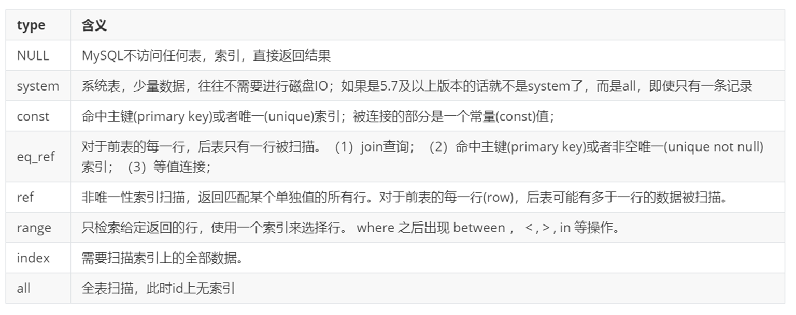

结果值从最好到最坏依次是：system > const > eq_ref > ref > range > index > ALL

```sql
-- EXPLAIN之type


-- NULL:不访问任何表，任何索引，直接返回结果
EXPLAIN SELECT NOW(); 
EXPLAIN SELECT RAND(); 

-- SYSTEM:查询系统表，表示直接从内存读取数据，不会从磁盘读取，但是5.7及以上版本不再显示system，直接显示ALL
EXPLAIN SELECT * FROM mysql.tables_priv;

-- CONST
EXPLAIN SELECT * FROM user WHERE uid = 2;
EXPLAIN SELECT * FROM user WHERE uname = '张飞';

CREATE UNIQUE INDEX index_uname ON user(uname);	-- 创建唯一索引
DROP INDEX index_uname ON user;	-- 删除索引

CREATE INDEX index_uname ON user(uname);

-- eq_ref	左表有主键，而且左表的每一行和右表的每一行刚好匹配

CREATE TABLE user2(
	id INT,
	name VARCHAR(20)
);

INSERT INTO user2 VALUES(1, '张三');
INSERT INTO user2 VALUES(2, '李四');
INSERT INTO user2 VALUES(3, '王五');

CREATE TABLE user2_ex(
	id INT,
	age INT
);

INSERT INTO user2_ex VALUES(1, 20);
INSERT INTO user2_ex VALUES(2, 21);
INSERT INTO user2_ex VALUES(3, 22);

-- 验证
EXPLAIN SELECT * FROM user2 a, user2_ex b WHERE a.id = b.id;	-- ALL

-- 给user2表添加主键索引
ALTER TABLE user2 ADD PRIMARY KEY(id); 

EXPLAIN SELECT * FROM user2 a, user2_ex b WHERE a.id = b.id;	-- eq_ref

-- 在user_ex表添加一个重复的行数据
EXPLAIN SELECT * FROM user2 a, user2_ex b WHERE a.id = b.id;	-- ALL

-- ref	左表有普通索引，和右表匹配时可能会匹配多行

-- 给user2表添加普通索引
ALTER TABLE user2 DROP PRIMARY KEY;
CREATE INDEX index_id ON user2(id);
 
EXPLAIN SELECT * FROM user2 a, user2_ex b WHERE a.id = b.id;	-- ref

-- RANGE	范围查询
EXPLAIN SELECT * FROM user2 WHERE id > 2; 

-- INDEX	把索引列的全部数据都扫描
EXPLAIN SELECT id FROM user2;	-- INDEX

-- ALL
EXPLAIN SELECT * FROM user2;	-- ALL
```

#### 4.其他指标字段

- table
  显示这一步所访问数据库中表名称有时不是真实的表名字，可能是简称。

- rows
  扫描行的数量

- key

  possible_keys : 显示可能应用在这张表的索引， 一个或多个。 

  key ： 实际使用的索引， 如果为NULL， 则没有使用索引。

  key_len : 表示索引中使用的字节数， 该值为索引字段最大可能长度，并非实际使用长度，在不损失精确性的前提下， 长度越短越好 。
  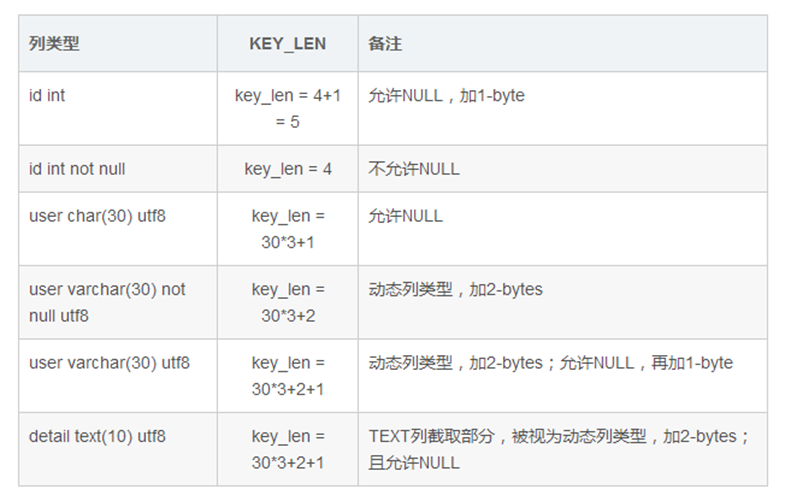

- extra
  其他的额外的执行计划信息，在该列展示 。
  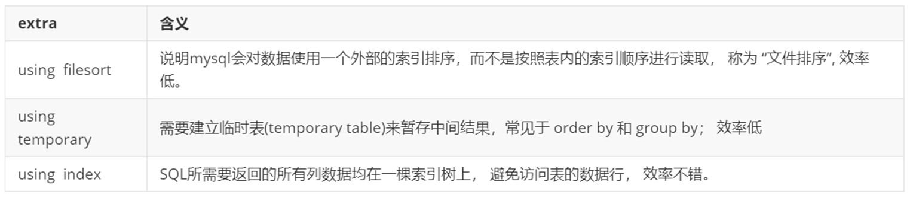

### 5、SHOW PROFILE分析SQL

Mysql从5.0.37版本开始增加了对 show profiles 和 show profile 语句的支持。show profiles 能够在做SQL优化时帮助我们了解时间都耗费到哪里去了。

通过 have_profiling 参数，能够看到当前MySQL是否支持profile：

```sql
-- 查看当前的MySQL是否支持profile
SELECT @@have_profiling;
-- 如果不支持，则需要设置打开
SET profiling = 1;
```

通过profile，我们能够更清楚地了解SQL执行的过程。首先，我们可以执行一系列的操作

```sql
-- 执行SQL
SHOW DATABASES;
USE mydb13_optimize;
SHOW TABLES;
SELECT COUNT(*) FROM user;
SELECT * FROM user WHERE uid > 2;
```

执行完上述命令之后，再执行show profiles 指令， 来查看SQL语句执行的耗时：

```sql
SHOW PROFILES;
```

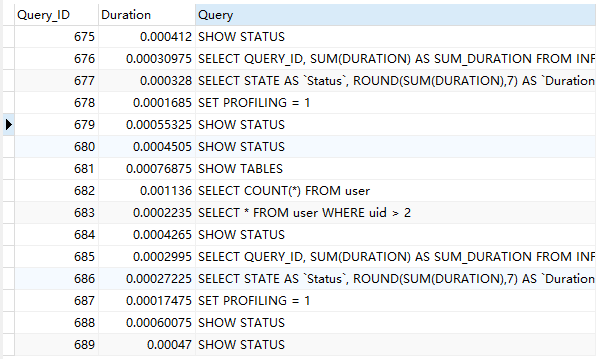

通过show profile for query query_id 语句可以查看到该SQL执行过程中每个线程的状态和消耗的时间：

```sql
SHOW PROFILE FOR QUERY 712;
```

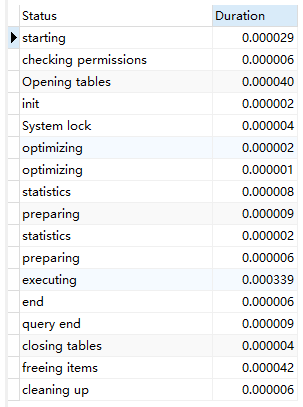

在获取到最消耗时间的线程状态后，MySQL支持进一步选择all、cpu、block io 、context switch、page faults等明细类型类查看MySQL在使用什么资源上耗费了过高的时间。例如，选择查看CPU的耗费时间 ：

```sql
SHOW PROFILE cpu FOR QUERY 712;
```

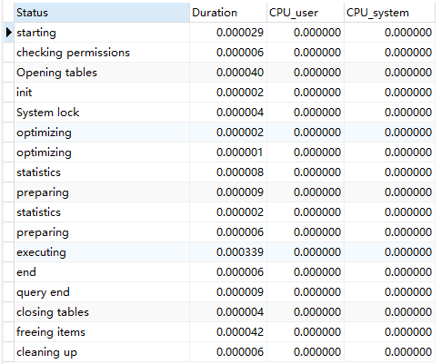

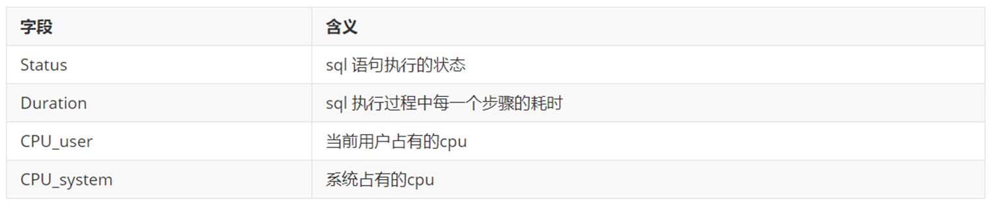

### 6、trace分析优化器执行计划

MySQL5.6提供了对SQL的跟踪trace, 通过trace文件能够进一步了解为什么优化器选择A计划, 而不是选择B计划。

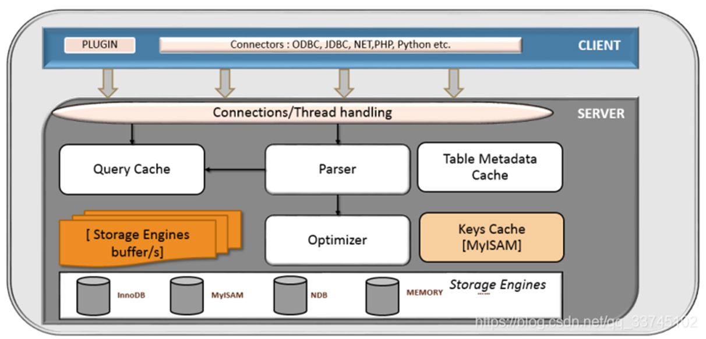

打开trace ， 设置格式为 JSON，并设置trace最大能够使用的内存大小，避免解析过程中因为默认内存过小而不能够完整展示。

```sql
SET optimizer_trace = "enabled=on", end_markers_in_json = ON;
SET optimizer_trace_max_mem_size = 1000000;

SELECT * FROM user a, user_role b, role c WHERE a.uid = b.uid AND b.rid = c.rid;

SELECT * FROM information_schema.optimizer_trace \G;
```

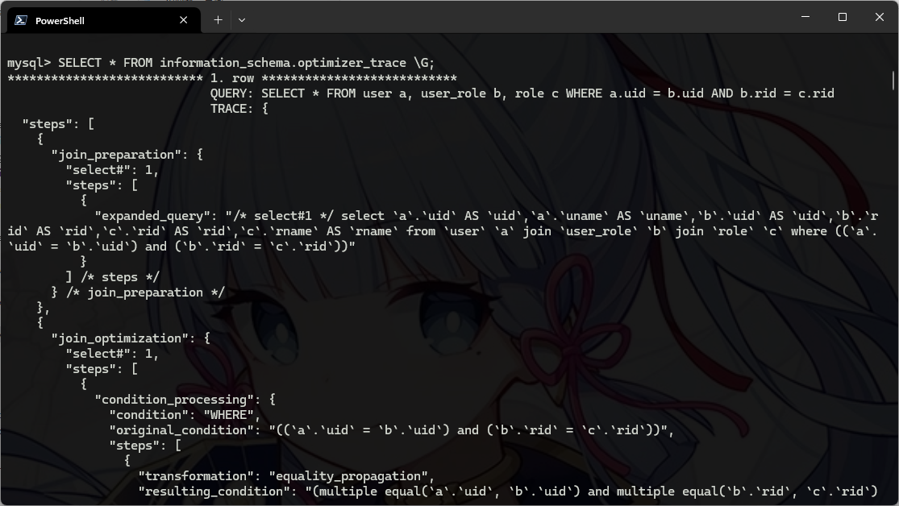

### 7、使用索引优化

索引是数据库优化最常用也是最重要的手段之一, 通过索引通常可以帮助用户解决大多数的MySQL的性能优化问题。

#### 1.数据准备

```sql
-- 数据准备
create table `tb_seller` (
    `sellerid` varchar (100),
    `name` varchar (100),
    `nickname` varchar (50),
    `password` varchar (60),
    `status` varchar (1),
    `address` varchar (100),
    `createtime` datetime,
    primary key(`sellerid`)
); 

insert into `tb_seller` (`sellerid`, `name`, `nickname`, `password`, `status`, `address`, `createtime`) values('alibaba','阿里巴巴','阿里小店','e10adc3949ba59abbe56e057f20f883e','1','北京市','2088-01-01 12:00:00');
insert into `tb_seller` (`sellerid`, `name`, `nickname`, `password`, `status`, `address`, `createtime`) values('baidu','百度科技有限公司','百度小店','e10adc3949ba59abbe56e057f20f883e','1','北京市','2088-01-01 12:00:00');
insert into `tb_seller` (`sellerid`, `name`, `nickname`, `password`, `status`, `address`, `createtime`) values('huawei','华为科技有限公司','华为小店','e10adc3949ba59abbe56e057f20f883e','0','北京市','2088-01-01 12:00:00');
insert into `tb_seller` (`sellerid`, `name`, `nickname`, `password`, `status`, `address`, `createtime`) values('itcast','传智播客教育科技有限公司','传智播客','e10adc3949ba59abbe56e057f20f883e','1','北京市','2088-01-01 12:00:00');
insert into `tb_seller` (`sellerid`, `name`, `nickname`, `password`, `status`, `address`, `createtime`) values('itheima','黑马程序员','黑马程序员','e10adc3949ba59abbe56e057f20f883e','0','北京市','2088-01-01 12:00:00');
insert into `tb_seller` (`sellerid`, `name`, `nickname`, `password`, `status`, `address`, `createtime`) values('luoji','罗技科技有限公司','罗技小店','e10adc3949ba59abbe56e057f20f883e','1','北京市','2088-01-01 12:00:00');
insert into `tb_seller` (`sellerid`, `name`, `nickname`, `password`, `status`, `address`, `createtime`) values('oppo','OPPO科技有限公司','OPPO官方旗舰店','e10adc3949ba59abbe56e057f20f883e','0','北京市','2088-01-01 12:00:00');
insert into `tb_seller` (`sellerid`, `name`, `nickname`, `password`, `status`, `address`, `createtime`) values('ourpalm','掌趣科技股份有限公司','掌趣小店','e10adc3949ba59abbe56e057f20f883e','1','北京市','2088-01-01 12:00:00');
insert into `tb_seller` (`sellerid`, `name`, `nickname`, `password`, `status`, `address`, `createtime`) values('qiandu','千度科技','千度小店','e10adc3949ba59abbe56e057f20f883e','2','北京市','2088-01-01 12:00:00');
insert into `tb_seller` (`sellerid`, `name`, `nickname`, `password`, `status`, `address`, `createtime`) values('sina','新浪科技有限公司','新浪官方旗舰店','e10adc3949ba59abbe56e057f20f883e','1','北京市','2088-01-01 12:00:00');
insert into `tb_seller` (`sellerid`, `name`, `nickname`, `password`, `status`, `address`, `createtime`) values('xiaomi','小米科技','小米官方旗舰店','e10adc3949ba59abbe56e057f20f883e','1','西安市','2088-01-01 12:00:00');
insert into `tb_seller` (`sellerid`, `name`, `nickname`, `password`, `status`, `address`, `createtime`) values('yijia','宜家家居','宜家家居旗舰店','e10adc3949ba59abbe56e057f20f883e','1','北京市','2088-01-01 12:00:00');
-- 创建组合索引 
create index idx_seller_name_sta_addr on tb_seller(name,status,address);
```

#### 2.避免索引失效应用-全值匹配

该情况下，索引生效，执行效率高。

```sql
-- 全值匹配，和字段匹配成功即可，和字段无关
EXPLAIN SELECT * FROM tb_seller WHERE name = '小米科技' AND STATUS = '1' AND address = '北京市';

EXPLAIN SELECT * FROM tb_seller WHERE address = '北京市' AND name = '小米科技' AND STATUS = '1';
```

#### 3.避免索引失效应用-最左前缀法则

该情况下，索引生效，执行效率高。

```sql
-- 最左前缀法则
-- 如果索引了多列，要遵守最左前缀法则。指的是查询从索引的最左前列开始，并且不跳过索引中的列
EXPLAIN SELECT * FROM tb_seller WHERE name = '小米科技';	-- 403

EXPLAIN SELECT * FROM tb_seller WHERE name = '小米科技' AND status = '1';	-- 410

EXPLAIN SELECT * FROM tb_seller WHERE status = '1' AND name = '小米科技';	-- 410

-- 违法最左前缀法则，索引失效
EXPLAIN SELECT * FROM tb_seller WHERE status = '1';	-- NULL

-- 如果符合最左法则，但是出现跳跃某一列，只有最左列索引生效：
EXPLAIN SELECT * FROM tb_seller WHERE name = '小米科技' AND address = '北京市'; 	-- 403
```

#### 4.避免索引失效应用-其他匹配原则

该情况下，索引生效，执行效率高。

```sql
-- 其他匹配原则

-- 范围查询右边的列，不能使用索引
-- 根据前面的两个字段name，status查询是走索引的，但是最后一个条件address没有用到索引
EXPLAIN SELECT * FROM tb_seller WHERE name = '小米科技' AND status > '1' AND address = '北京市';

-- 不要再索引列上进行运算操作，索引将失效
EXPLAIN SELECT * FROM tb_seller WHERE SUBSTRING(name, 3, 2) = '科技';

-- 字符串不加单引号，造成索引失效
EXPLAIN SELECT * FROM tb_seller WHERE name = '小米科技' AND status = 1;

-- 尽量使用覆盖索引，避免select *
-- 需要从原表及磁盘上读取数据
EXPLAIN SELECT * FROM tb_seller WHERE name = '小米科技' AND address = '北京市';

-- 从索引树中就可以查询到所有数据
EXPLAIN SELECT name FROM tb_seller WHERE name = '小米科技' AND address = '北京市';	-- 效率高
EXPLAIN SELECT name, status, address FROM tb_seller WHERE name = '小米科技' AND address = '北京市';	-- 效率高
EXPLAIN SELECT name, status, address, password FROM tb_seller WHERE name = '小米科技' AND address = '北京市';	-- 效率低

-- 用or分隔开的条件，那么涉及的索引都不会被用到
EXPLAIN SELECT * FROM tb_seller WHERE name = '黑马程序员' OR createtime = '2088-01-01 12:00:00';
EXPLAIN SELECT * FROM tb_seller WHERE name = '黑马程序员' OR address = '西安市';
EXPLAIN SELECT * FROM tb_seller WHERE name = '黑马程序员' OR status = '1';

-- 以%开头的like模糊查询，索引失效
EXPLAIN SELECT * FROM tb_seller WHERE name LIKE '科技%';	-- 用索引
EXPLAIN SELECT * FROM tb_seller WHERE name LIKE '%科技';	-- 不用索引
EXPLAIN SELECT * FROM tb_seller WHERE name LIKE '%科技%';	-- 不用索引

-- 弥补不足，不用*，使用索引列
EXPLAIN SELECT name FROM tb_seller WHERE name LIKE '%科技%';	-- 用索引

-- 如果MySQL评估使用索引比全表更慢，则不使用索引
-- 这种情况是由数据本身的特点来决定的
CREATE INDEX index_address ON tb_seller(address);

EXPLAIN SELECT * FROM tb_seller WHERE address = '北京市';	-- 没有使用索引
EXPLAIN SELECT * FROM tb_seller WHERE address = '西安市';	-- 没有使用索引

-- IS NULL，IS NOT NULL	有时有效，有时索引失效
CREATE INDEX index_nickname ON tb_seller(nickname);
EXPLAIN SELECT * FROM tb_seller WHERE nickname IS NULL;	-- 索引有效
EXPLAIN SELECT * FROM tb_seller WHERE nickname IS NOT NULL;	-- 索引无效

-- IN走索引，NOT IN索引失效
-- 普通索引
EXPLAIN SELECT * FROM tb_seller WHERE nickname IN('阿里小店', '百度小店');	-- 索引有效
EXPLAIN SELECT * FROM tb_seller WHERE nickname NOT IN('阿里小店', '百度小店');	-- 索引无效

-- 主键索引
EXPLAIN SELECT * FROM tb_seller WHERE sellerid IN('alibaba', 'baidu');	-- 使用索引
EXPLAIN SELECT * FROM tb_seller WHERE sellerid NOT IN('alibaba', 'baidu');	-- 使用索引

-- 单列索引和复合索引，尽量使用复合索引
create index idx_seller_name_sta_addr on tb_seller(name,status,address);
/*
	等价于：
		name
		name + status
		name + status + address
*/
-- 如果一张表有多个单列索引，即使where中都使用了这些索引列，则只有一个最优索引生效

DROP INDEX idx_seller_name_sta_addr ON tb_seller;
DROP INDEX index_nickname ON tb_seller;

SHOW INDEX FROM tb_seller;

CREATE INDEX index_name ON tb_seller(name);
CREATE INDEX index_status ON tb_seller(status);
CREATE INDEX index_address ON tb_seller(address);

EXPLAIN SELECT * FROM tb_seller WHERE name = '小米科技' AND status = '1' AND address = '西安市';
EXPLAIN SELECT * FROM tb_seller WHERE name = '小米科技' AND status = '1';
```

### 8、SQL优化

#### 1.大批量插入数据

```sql
create table `tb_user` (
  `id` int(11) not null auto_increment,
  `username` varchar(45) not null,
  `password` varchar(96) not null,
  `name` varchar(45) not null,
  `birthday` datetime default null,
  `sex` char(1) default null,
  `email` varchar(45) default null,
  `phone` varchar(45) default null,
  `qq` varchar(32) default null,
  `status` varchar(32) not null comment '用户状态',
  `create_time` datetime not null,
  `update_time` datetime default null,
  primary key (`id`),
  unique key `unique_user_username` (`username`)
);
```

当使用load 命令导入数据的时候，适当的设置可以提高导入的效率。对于 InnoDB 类型的表，有以下几种方式可以提高导入的效率：

1. 主键顺序插入
   因为InnoDB类型的表是按照主键的顺序保存的，所以将导入的数据按照主键的顺序排列，可以有效的提高导入数据的效率。如果InnoDB表没有主键，那么系统会自动默认创建一个内部列作为主键，所以如果可以给表创建一个主键，将可以利用这点，来提高导入数据的效率。
   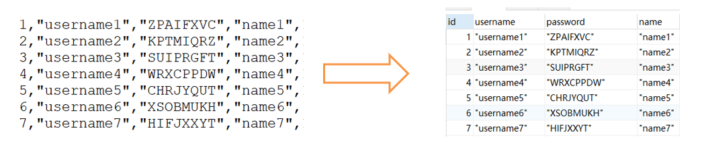

   ```sql
   -- 主键顺序插入
   
   -- 1、首先，检查一个全局系统变量 'local_infile' 的状态， 如果得到如下显示 Value=OFF，则说明这是不可用的
   SHOW GLOBAL VARIABLES LIKE 'local_infile';
   
   -- 2、修改local_infile值为on，开启local_infile
   SET GLOBAL local_infile = 1;
   
   -- 3、加载数据 
   LOAD DATA LOCAL INFILE 'D:\\sql_data\\sql1.log' INTO TABLE tb_user FIELDS TERMINATED BY ',' LINES TERMINATED BY '\n';
   ```

2. 关闭唯一性校验
   在导入数据前执行 SET UNIQUE_CHECKS=0，关闭唯一性校验，在导入结束后执行SET UNIQUE_CHECKS=1，恢复唯一性校验，可以提高导入的效率。

   ```sql
   -- 关闭唯一性校验
   -- 如果主键列数据本身就没有重复的，那么就没必要进行唯一性校验 
   SET UNIQUE_CHECKS = 0;
   
   SET UNIQUE_CHEKCS = 1;
   ```

#### 2.优化insert语句

当进行数据的insert操作的时候，可以考虑采用以下几种优化方案:

```sql
-- 优化insert语句

CREATE TABLE tb_test(
	id INT PRIMARY KEY,
	name VARCHAR(20)
);

-- 如果需要同时对一张表插入很多行数据时，应该尽量使用多个值表的insert语句，这种方式将大大的缩减客户端与数据库之间的连接、关闭等消耗。使得效率比分开执行的单个insert语句快。

-- 原始方式为：
insert into tb_test values(1,'Tom');
insert into tb_test values(2,'Cat');
insert into tb_test values(3,'Jerry');
 
 
-- 优化后的方案为 ： 
 
insert into tb_test values(1,'Tom'),(2,'Cat')，(3,'Jerry');

-- 在事务中进行数据插入。
begin;
insert into tb_test values(1,'Tom');
insert into tb_test values(2,'Cat');
insert into tb_test values(3,'Jerry');
commit;


-- 数据有序插入
insert into tb_test values(4,'Tim');
insert into tb_test values(1,'Tom');
insert into tb_test values(3,'Jerry');
insert into tb_test values(5,'Rose');
insert into tb_test values(2,'Cat');
 
 
-- 优化后
insert into tb_test values(1,'Tom');
insert into tb_test values(2,'Cat');
insert into tb_test values(3,'Jerry');
insert into tb_test values(4,'Tim');
insert into tb_test values(5,'Rose');
```

#### 3.优化ORDER BY语句

环境准备：

```sql
CREATE TABLE `emp` (
  `id` int(11) NOT NULL AUTO_INCREMENT,
  `name` varchar(100) NOT NULL,
  `age` int(3) NOT NULL,
  `salary` int(11) DEFAULT NULL,
  PRIMARY KEY (`id`)
);
 
insert into `emp` (`id`, `name`, `age`, `salary`) values('1','Tom','25','2300');
insert into `emp` (`id`, `name`, `age`, `salary`) values('2','Jerry','30','3500');
insert into `emp` (`id`, `name`, `age`, `salary`) values('3','Luci','25','2800');
insert into `emp` (`id`, `name`, `age`, `salary`) values('4','Jay','36','3500');
insert into `emp` (`id`, `name`, `age`, `salary`) values('5','Tom2','21','2200');
insert into `emp` (`id`, `name`, `age`, `salary`) values('6','Jerry2','31','3300');
insert into `emp` (`id`, `name`, `age`, `salary`) values('7','Luci2','26','2700');
insert into `emp` (`id`, `name`, `age`, `salary`) values('8','Jay2','33','3500');
insert into `emp` (`id`, `name`, `age`, `salary`) values('9','Tom3','23','2400');
insert into `emp` (`id`, `name`, `age`, `salary`) values('10','Jerry3','32','3100');
insert into `emp` (`id`, `name`, `age`, `salary`) values('11','Luci3','26','2900');
insert into `emp` (`id`, `name`, `age`, `salary`) values('12','Jay3','37','4500');
 
create index idx_emp_age_salary on emp(age,salary);
```

- 两种排序方式
  第一种是通过对返回数据进行排序，也就是通常说的 filesort 排序，所有不是通过索引直接返回排序结果的排序都叫 FileSort 排序。
  第二种通过有序索引顺序扫描直接返回有序数据，这种情况即为 using index，不需要额外排序，操作效率高。

- Filesort 的优化
  通过创建合适的索引，能够减少 Filesort 的出现，但是在某些情况下，条件限制不能让Filesort消失，那就需要加快 Filesort的排序操作。对于Filesort ， MySQL 有两种排序算法：

  1. 两次扫描算法 ：MySQL4.1 之前，使用该方式排序。首先根据条件取出排序字段和行指针信息，然后在排序区 sort buffer 中排序，如果sort buffer不够，则在临时表 temporary table 中存储排序结果。完成排序之后，再根据行指针回表读取记录，该操作可能会导致大量随机I/O操作。
  2. 一次扫描算法：一次性取出满足条件的所有字段，然后在排序区 sort buffer 中排序后直接输出结果集。排序时内存开销较大，但是排序效率比两次扫描算法要高。

  MySQL 通过比较系统变量 max_length_for_sort_data 的大小和Query语句取出的字段总大小， 来判定是否那种排序算法，如果max_length_for_sort_data 更大，那么使用第二种优化之后的算法；否则使用第一种。

  可以适当提高 sort_buffer_size 和 max_length_for_sort_data 系统变量，来增大排序区的大小，提高排序的效率。

```sql
-- ORDER BY

EXPLAIN SELECT * FROM emp ORDER BY age; -- Using filesort
EXPLAIN SELECT * FROM emp ORDER BY age, salary; -- Using filesort

EXPLAIN SELECT id FROM emp ORDER BY age; -- Using index
EXPLAIN SELECT id, age FROM emp ORDER BY age; -- Using index
EXPLAIN SELECT id, age, salary, name FROM emp ORDER BY age; -- Using filesort

-- ORDER BY后边的多个排序字段要求尽量排序方式相同
EXPLAIN SELECT id, age FROM emp ORDER BY age, salary; -- Using index
EXPLAIN SELECT id, age FROM emp ORDER BY age asc, salary DESC; -- Using index; Using filesort
EXPLAIN SELECT id, age FROM emp ORDER BY age DESC, salary DESC; -- Backward index scan; Using index

-- ORDER BY 后边的多个排序字段顺序尽量和组合索引字段顺序一致
EXPLAIN SELECT id, age FROM emp ORDER BY salary, age; -- Using index; Using filesort


-- Filesort的优化

SHOW VARIABLES LIKE 'max_length_for_sort_data';	-- 4096
SHOW VARIABLES LIKE 'sort_buffer_size';	-- 262144
```

#### 4.优化子查询

使用子查询可以一次性的完成很多逻辑上需要多个步骤才能完成的SQL操作，同时也可以避免事务或者表锁死，并且写起来也很容易。但是，有些情况下，子查询是可以被更高效的连接（JOIN）替代。

```sql
EXPLAIN SELECT * FROM user WHERE uid in (SELECT uid FROM user_role);
```

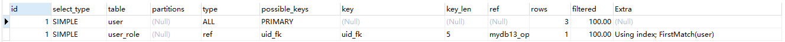

```sql
EXPLAIN SELECT * FROM user u, user_role ur WHERE u.uid = ur.uid;
```

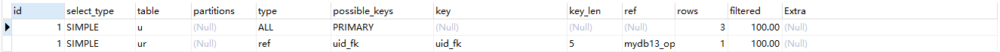

连接(Join)查询之所以更有效率一些 ，是因为MySQL不需要在内存中创建临时表来完成这个逻辑上需要两个步骤的查询工作。

#### 5.优化limit查询

一般分页查询时，通过创建覆盖索引能够比较好地提高性能。一个常见又非常头疼的问题就是 limit 900000,10 ，此时需要MySQL排序前900010 记录，仅仅返回900000 - 900010 的记录，其他记录丢弃，查询排序的代价非常大 。

1. 优化思路一
   在索引上完成排序分页操作，最后根据主键关联回原表查询所需要的其他列内容。
2. 优化思路二
   该方案适用于主键自增的表，可以把Limit 查询转换成某个位置的查询 。
